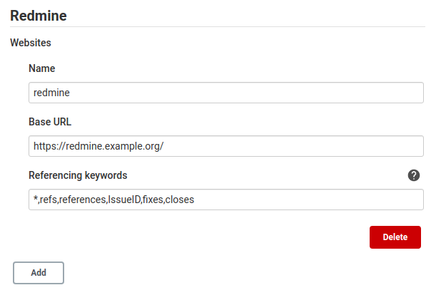
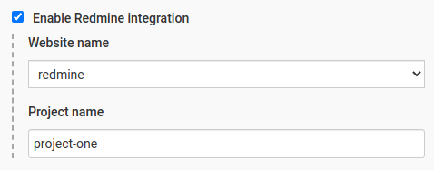
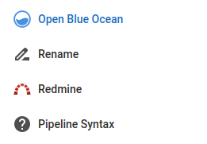

# Jenkins Redmine plugin

This plugin adds Redmine integration to Jenkins.

## What's this?

This plugin is a partial rewrite of the previous `redmine` plugin: https://github.com/jenkinsci/redmine-plugin.

## Why?

The previous plugin has evolve over the years, trying to keep backwards compatibility with older redmine versions, adding more and more features: changelog annotations, authenication, metrics, etc.  
All these things makes the codebase harder to mantain and keep up the modern Jenkins pace. 

This plugin is mainly focused on the **changelog issues integration feature** (changelog annotator), trying to keep the things simple and correct.  
Building it from the ground, allows us to take advantage of the new jenkins features and coding best practices.

## How to use it?

One or more Redmine websites could be configured globally:



... and then referenced per job by the `websiteName` given in the global configuration:



Once configured for a job, the changelog will be parsed, creating links for every issue reference found, taking into account the reference keywords configured for the redmine website.

Also, if a Redmine `projectName` is configured for the job, a new link to the Redmine project location will be added to the job menu.



## Configuration-as-Code & JobDSL

This plugins is [JCasC](https://www.jenkins.io/projects/jcasc/) and [JobDSL](https://plugins.jenkins.io/job-dsl/) compatible, allowing a fully configured jenkins instance and jobs without touching the UI.

JCasC example:
```yaml
unclassified:  
  redmine:
    websites:
      - name: redmine
        baseUrl: https://redmine.example.org/
        referencingKeywords: "*,refs,references,IssueID,fixes,closes"
```

JobDSL example:
```groovy
job('example') {
  properties {
    redmine {
      websiteName('redmine')
      projectName('project-one')
    }
  }
}
```

## How to buid from sources

For all UNIX-based platforms (including MacOS) simply run:
```
./mvnw clean install
```

The plugin, ready to be installed in Jenkins, could be found at `target/redmine.hpi`.